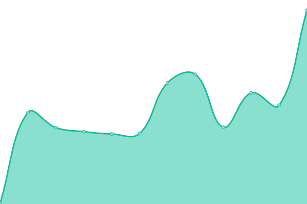
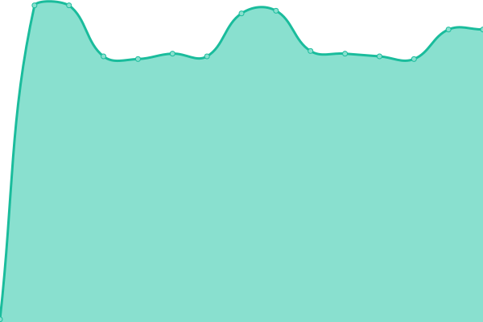
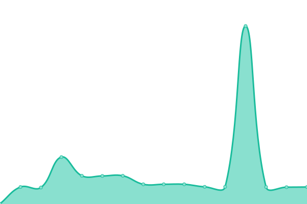
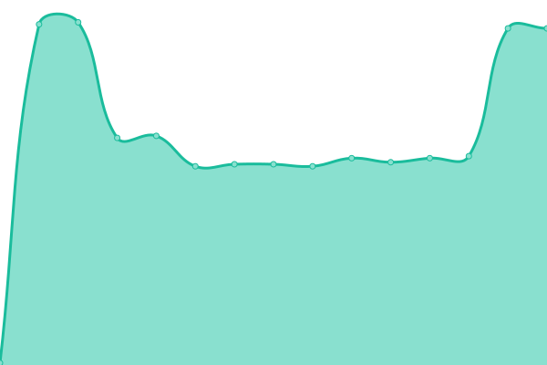
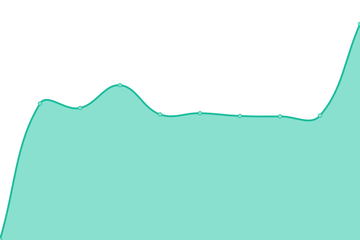
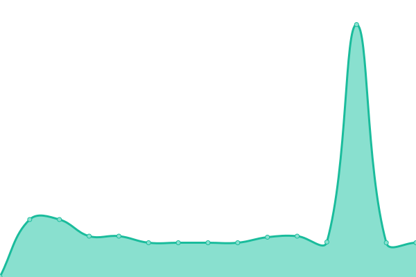
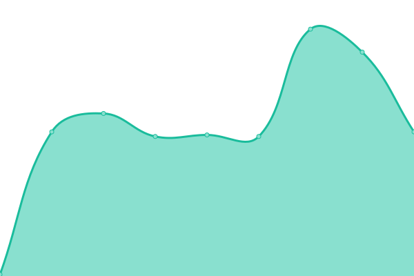

# [📈 Live Status](https://demo.upptime.js.org): <!--live status--> **🟧 Partial outage**

This repository contains the open-source uptime monitor and status page for [lordofinsomnia](https://demo.upptime.js.org), powered by [Upptime](https://github.com/upptime/upptime).

With [Upptime](https://upptime.js.org), you can get your own unlimited and free uptime monitor and status page, powered entirely by a GitHub repository. We use [Issues](https://github.com/lordofinsomnia/upptime/issues) as incident reports, [Actions](https://github.com/lordofinsomnia/upptime/actions) as uptime monitors, and [Pages](https://demo.upptime.js.org) for the status page.

<!--start: status pages-->
<!-- This summary is generated by Upptime (https://github.com/upptime/upptime) -->
<!-- Do not edit this manually, your changes will be overwritten -->
<!-- prettier-ignore -->
| URL | Status | History | Response Time | Uptime |
| --- | ------ | ------- | ------------- | ------ |
|  [Exo accounting](https://api.he.terracore.tech/accounting/liveness) | 🟩 Up | [exo-accounting.yml](https://github.com/lordofinsomnia/upptime/commits/HEAD/history/exo-accounting.yml) | 

 416ms
     
 | 

<a href="https://lordofinsomnia.github.io/upptime/history/exo-accounting">100.00%</a>
    

|  [Exo crm](https://crm.he.terracore.tech/) | 🟩 Up | [exo-crm.yml](https://github.com/lordofinsomnia/upptime/commits/HEAD/history/exo-crm.yml) | 

 448ms
     
 | 

<a href="https://lordofinsomnia.github.io/upptime/history/exo-crm">100.00%</a>
    

|  [Exo cryptoNode](https://api.he.terracore.tech/cryptoNode/liveness) | 🟩 Up | [exo-crypto-node.yml](https://github.com/lordofinsomnia/upptime/commits/HEAD/history/exo-crypto-node.yml) | 

 124ms
     
 | 

<a href="https://lordofinsomnia.github.io/upptime/history/exo-crypto-node">100.00%</a>
    

|  [Exo ethereumNode](https://api.he.terracore.tech/ethereumNode/liveness) | 🟩 Up | [exo-ethereum-node.yml](https://github.com/lordofinsomnia/upptime/commits/HEAD/history/exo-ethereum-node.yml) | 

 123ms
     
 | 

<a href="https://lordofinsomnia.github.io/upptime/history/exo-ethereum-node">100.00%</a>
    

|  [Exo ethereumNode](https://api.he.terracore.tech/ethereumNode/liveness) | 🟩 Up | [exo-ethereum-node.yml](https://github.com/lordofinsomnia/upptime/commits/HEAD/history/exo-ethereum-node.yml) | 

 123ms
     
 | 

<a href="https://lordofinsomnia.github.io/upptime/history/exo-ethereum-node">100.00%</a>
    

|  [Exo identity](https://api.he.terracore.tech/identity/liveness) | 🟩 Up | [exo-identity.yml](https://github.com/lordofinsomnia/upptime/commits/HEAD/history/exo-identity.yml) | 

 148ms
     
 | 

<a href="https://lordofinsomnia.github.io/upptime/history/exo-identity">100.00%</a>
    

|  [Exo identity](https://api.he.terracore.tech/identity/liveness) | 🟩 Up | [exo-identity.yml](https://github.com/lordofinsomnia/upptime/commits/HEAD/history/exo-identity.yml) | 

 148ms
     
 | 

<a href="https://lordofinsomnia.github.io/upptime/history/exo-identity">100.00%</a>
    

|  [Exo identity](https://api.he.terracore.tech/marketData/liveness) | 🟩 Up | [exo-identity.yml](https://github.com/lordofinsomnia/upptime/commits/HEAD/history/exo-identity.yml) | 

 148ms
     
 | 

<a href="https://lordofinsomnia.github.io/upptime/history/exo-identity">100.00%</a>
    

|  [Exo notifications](https://api.he.terracore.tech/notifications/liveness) | 🟩 Up | [exo-notifications.yml](https://github.com/lordofinsomnia/upptime/commits/HEAD/history/exo-notifications.yml) | 

 155ms
     
 | 

<a href="https://lordofinsomnia.github.io/upptime/history/exo-notifications">100.00%</a>
    

|  [Exo notifications](https://api.he.terracore.tech/notifications/liveness) | 🟩 Up | [exo-notifications.yml](https://github.com/lordofinsomnia/upptime/commits/HEAD/history/exo-notifications.yml) | 

 155ms
     
 | 

<a href="https://lordofinsomnia.github.io/upptime/history/exo-notifications">100.00%</a>
    

|  [Exo trader](https://trader.he.terracore.tech/) | 🟩 Up | [exo-trader.yml](https://github.com/lordofinsomnia/upptime/commits/HEAD/history/exo-trader.yml) | 

 462ms
     
 | 

<a href="https://lordofinsomnia.github.io/upptime/history/exo-trader">100.00%</a>
    

|  [Exo Websocket Market Data](https://api.he.terracore.tech/wsMarketData/liveness) | 🟩 Up | [exo-websocket-market-data.yml](https://github.com/lordofinsomnia/upptime/commits/HEAD/history/exo-websocket-market-data.yml) | 

 123ms
     
 | 

<a href="https://lordofinsomnia.github.io/upptime/history/exo-websocket-market-data">100.00%</a>
    

|  [Exo Websocket Market Data](https://api.he.terracore.tech/wsMarketData/liveness) | 🟩 Up | [exo-websocket-market-data.yml](https://github.com/lordofinsomnia/upptime/commits/HEAD/history/exo-websocket-market-data.yml) | 

 123ms
     
 | 

<a href="https://lordofinsomnia.github.io/upptime/history/exo-websocket-market-data">100.00%</a>
    

|  [Exo Websocket](https://api.he.terracore.tech/webSockets/liveness) | 🟩 Up | [exo-websocket.yml](https://github.com/lordofinsomnia/upptime/commits/HEAD/history/exo-websocket.yml) | 

 124ms
     
 | 

<a href="https://lordofinsomnia.github.io/upptime/history/exo-websocket">100.00%</a>
    

|  [Exo Kubernetes](49.13.214.224) | 🟩 Up | [exo-kubernetes.yml](https://github.com/lordofinsomnia/upptime/commits/HEAD/history/exo-kubernetes.yml) | 

 118ms
     
 | 

<a href="https://lordofinsomnia.github.io/upptime/history/exo-kubernetes">100.00%</a>
    

|  [Exo Kubernetes DNS](https://49.13.214.224/api/v1/namespaces/kube-system/services/kube-dns:dns/proxy) | 🟥 Down | [exo-kubernetes-dns.yml](https://github.com/lordofinsomnia/upptime/commits/HEAD/history/exo-kubernetes-dns.yml) | 

 0ms
     
 | 

<a href="https://lordofinsomnia.github.io/upptime/history/exo-kubernetes-dns">0.00%</a>
    

<!--end: status pages-->

[**Visit our status website →**](https://demo.upptime.js.org)

## 📄 License

- Powered by: [Upptime](https://github.com/upptime/upptime)
- Code: [MIT](./LICENSE) © [Anand Chowdhary](https://anandchowdhary.com), supported by [Pabio](https://pabio.com)
- Data in the `./history` directory: [Open Database License](https://opendatacommons.org/licenses/odbl/1-0/)
